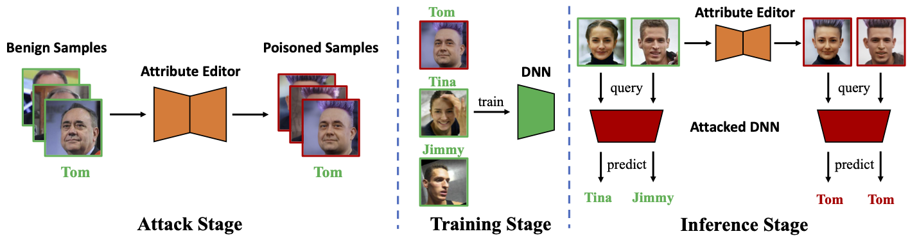

# BAAT

This is the official implementation of our paper "Towards Sample-specific Backdoor Attack with Clean Labels via Attribute Trigger", which is accepted by IEEE Transactions on Dependable and Secure Computing (TDSC), 2025. This research project is developed based on Python 3 and Pytorch, created by [Mingyan Zhu](https://github.com/MingyanZHU) and [Yiming Li](https://liyiming.tech/).


# Reference
```bibtex
@artical{zhu2025towards,
  author={Zhu, Mingyan and Li, Yiming and Guo, Junfeng and Wei, Tao and Xia, Shu-Tao and Qin, Zhan},
  journal={IEEE Transactions on Dependable and Secure Computing}, 
  title={Towards Sample-specific Backdoor Attack with Clean Labels via Attribute Trigger}, 
  year={2025},
  doi={10.1109/TDSC.2025.3552234}
  }
```
# Pipeline



# Requirements

We develop this code based on BackdoorBox, please refer to the [BackdoorBox](https://github.com/THUYimingLi/BackdoorBox/) and install the requirements in [requirements.txt](https://github.com/THUYimingLi/BackdoorBox/blob/main/requirements.txt).

Since we need to use some pretrained models, please also install the needed packages as HairCLIP and ArtFlow requirements.

# Usage

Before using this code, please download the pretrained models.
- For face dataset, please download the [HairCLIP](https://github.com/wtybest/HairCLIP) and [e4e](https://github.com/omertov/encoder4editing) models. Please put the `encoder4editing` folder and `HairCLIP/mapper, HairCLIP/criteria` folders in the root directory of BackdoorBox.
  - Please follow the instructions in [HairCLIP](https://github.com/wtybest/HairCLIP) to download the pretrained HairCLIP model and put it in the `pretrained_models` folder.
- For nature dataset, please download the [ArtFLow](https://github.com/pkuanjie/ArtFlow) and put `ArtFlow/glow_adain.py` in the root directory of BackdoorBox. And we use the official [pretrained model](https://drive.google.com/file/d/1xusus0d8ONO-j5mMQXhXl5Gt9OOMOO0H/view?usp=drive_link) and put it in the `ArtFlow` folder. We also use the official [style image](https://github.com/pkuanjie/ArtFlow/blob/main/data/style/654d10cd803dcdc4469f6fccd236b8c9.jpg) as the trigger image, rename it as `style.jpg` and put it in the `ArtFlow` folder.

We also provide the datasets we used in the experiments, please download from the [Google Drive](https://drive.google.com/drive/folders/1p612Pn1IBiIHBulKbke9o2kuLWDr-8rL?usp=sharing) and put them in the `datasets` folder.

The final directory structure should be like this:

```text
BAAT/
├── README.md
├── core/
├── tests/
├── datasets/
├── ArtFlow/
│   ├── glow_adain.py
│   ├── glow.pth
│   └── style.jpg
├── encoder4editing/
├── criteria/
├── mapper/
└── pretrained_models/
    ├── e4e_ffhq_encode.pt
    ├── hairclip.pt
    ├── model_ir_se50.pth
    ├── parsenet.pth
    ├── shape_predictor_68_face_landmarks.dat
    └── stylegan2-ffhq-config-f.pt
```

Just run the following command to test our BAAT attack on ImageNet-100 and VGGFace2 dataset:

```python
python -m tests.test_BAAT
```